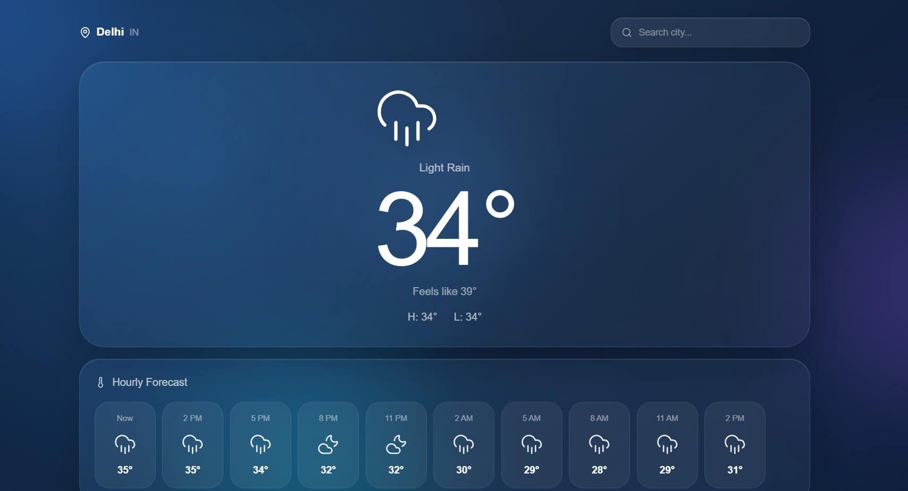
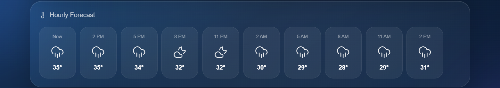
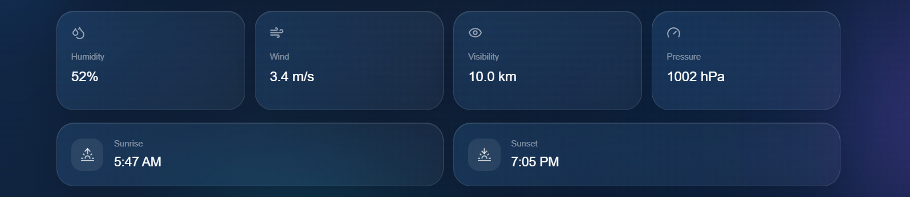

# 🌤️ Weather App

<p align="center">
  
</p>

<h3 align="center">
  A modern real-time weather application with a beautiful liquid glass interface.
</h3>

<p align="center">
  Built with React, Vite, Tailwind CSS and OpenWeather API.
</p>

<p align="center">

  <a href="https://shashwatstack-weather-app.netlify.app/">
    
  </a>

  

  

  

</p>

---

## 🌐 Live Demo

### 🔗 Live Website

**Live Demo:** https://shashwatstack-weather-app.netlify.app/

---

# 📸 Preview

<p align="center">
  
</p>

### 🌦️ Weather Dashboard

The main dashboard displays real-time weather information with a modern glassmorphism interface.

---

<p align="center">
  
</p>

### 🕐 Hourly Forecast

View upcoming hourly weather conditions with temperature and dynamic weather icons.

---

<p align="center">
  
</p>

### 📅 Weather Details & Forecast

View humidity, wind, visibility, pressure, sunrise, sunset and the upcoming 5-day forecast.

---

# ✨ Features

### 🌡️ Real-Time Weather

Get current weather information including:

- Current temperature
- Feels-like temperature
- High temperature
- Low temperature
- Current weather condition

---

### 🌤️ Dynamic Weather UI

The application automatically adapts its visual appearance according to the actual weather.

| Weather | Experience |
|---|---|
| ☀️ Clear Day | Bright blue / sunny atmosphere |
| 🌙 Clear Night | Dark night atmosphere |
| 🌧️ Rain | Deep blue rainy atmosphere |
| 🌧️ Night Rain | Dark rainy atmosphere |
| ☁️ Cloudy | Cloudy blue/gray atmosphere |
| ⛈️ Thunderstorm | Dark storm atmosphere |
| ❄️ Snow | Cold icy atmosphere |

---

### 🧊 Liquid Glass UI

The interface uses a modern glassmorphism design with:

- Translucent cards
- Background blur
- Soft gradients
- Saturated colors
- Rounded corners
- Subtle shadows
- Smooth transitions
- Atmospheric background effects

---

### 🔍 City Search

Search weather for any supported city.

Examples:

```text
Delhi
Mumbai
London
Tokyo
New York
Paris
Dubai
